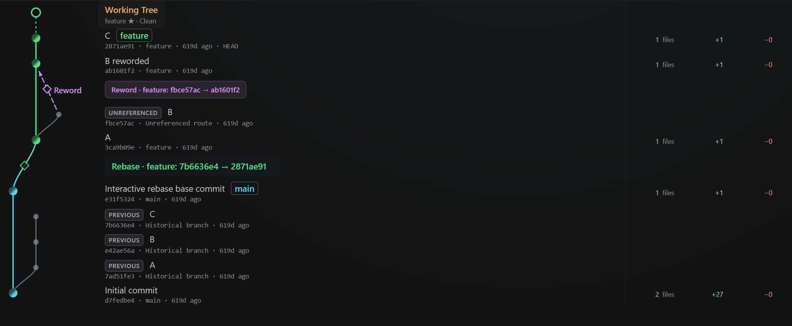
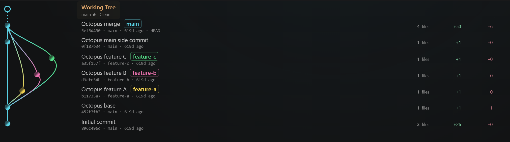
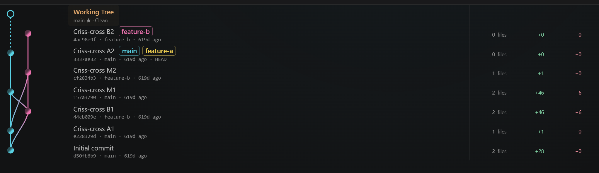
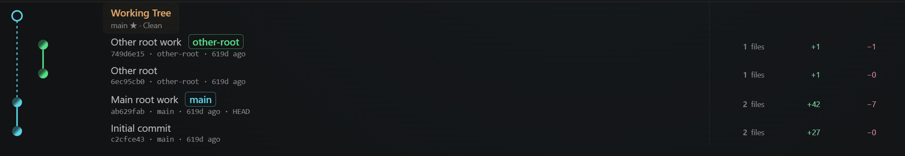
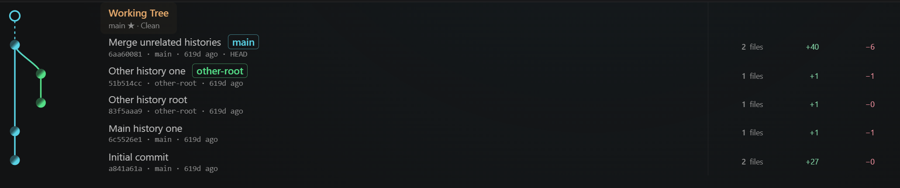
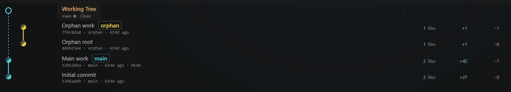

# Git Lines

[](https://github.com/Lye-0/git-lines/blob/main/README.md) [](https://github.com/Lye-0/git-lines/blob/main/README.en.md)

A read-only Git graph for VS Code. See the current DAG in stable lanes, with Operation Overlays only for operations that can be reliably reconstructed from standard Git data.

<p align="center">
  
</p>

Git Lines does not fill gaps with guesses. When evidence is insufficient, it leaves the current DAG without an inferred operation.

## What is Git Lines?

Git Lines places commit parent relationships (the DAG) and the current Working Tree on one timeline. Lanes are a visual arrangement; parent edges are never reassigned.

Operations such as Amend, Cherry-pick, and Rebase appear in a separate overlay layer only when **standard Git data still available**, such as reflogs and commit bodies, proves them. Similar messages or trees are not used to guess a source.

## Features

- Git graph with stable branch lanes
- Working Tree and in-progress operations on one timeline
- Operation Overlays backed by evidence
- Reflog-based PREVIOUS commits and historical routes
- Commit and Operation Detail panels
- Detached HEAD and multiple worktree annotations
- Read-only: does not execute checkout, merge, rebase, or other Git mutations

### Display options

Choose the editor, bottom panel, or left sidebar from **Git Lines** in the status bar. The sidebar uses narrower lanes and single-line messages aligned with commit nodes. Click to open details, including change statistics, in a popover; click outside or press Esc to close it.

Editor and bottom-panel views default to **Compact** density. History loading and pagination use performance optimizations, with improved long-distance connections and column alignment.

## Visual Overview

An overview of the graph. Expand the operation sections below for the meaning of each Git operation.

### Current DAG

Display the DAG reachable from current refs alongside the Working Tree.

<p align="center">
  
</p>

### Historical context

With Reflog enabled, show additional context including PREVIOUS commits, historical routes, and reflog-only history.

<p align="center">
  
</p>

### Grouped visualization

When related commits can be reliably identified, they may be grouped for readability. See each operation section for its specific semantics.

<p align="center">
  
</p>

### N → 1 rewrite

A dedicated overlay shows multiple commits collapsing into one when the rewrite can be reliably proven. Interactive Squash and Fixup are examples.

<p align="center">
  
</p>

### In-progress integration

In-progress Git operations are integrated into the Working Tree row, rather than represented as artificial commits.

<p align="center">
  
</p>

### Reflog OFF

Turning Reflog off removes overlays, PREVIOUS commits, and reflog-dependent classifications, leaving the Current DAG. Operations are not reconstructed from commit messages.

<p align="center">
  
</p>

See the operation sections below for examples of ref movements such as Reset and Branch move.

## Detail Panel

Inspect both commits and operations in Detail, including the evidence behind an operation.

<table>
  <tr>
    <td align="center" width="50%">
      <br>
      Commit
    </td>
    <td align="center" width="50%">
      <br>
      Operation
    </td>
  </tr>
</table>

Commit Detail shows additions, deletions, changed files, author, parents, and branch or route.

Operation Detail shows the operation type, Evidence, and only the information actually available for that relation: Mappings for Cherry-pick, independent Old order / New order for Rebase, or Old commits / New commit / Rewrite for Squash and Fixup.

## Evidence-first Design

```text
Reliable evidence     → Dedicated Operation Overlay
Partial / ambiguous   → Safe fallback (generic event or Current DAG)
No reliable evidence  → Current DAG only
```

Git Lines does not infer past operations solely from commit similarity or assumptions about what happened. It overlays only what can be proven and otherwise prioritizes the current DAG.

<details>
<summary><strong>Intentionally not inferred</strong></summary>

The following are **intentionally not inferred**, because standard Git data cannot establish them exactly:

- Source or range of a completed Squash Merge (the result looks like a normal single-parent commit)
- Noncontiguous member sets in Interactive Squash / Fixup
- Cherry-pick without a reliable source indicator such as `-x`

See [Graph architecture](docs/technical/graph-architecture.md) for detection conditions and research notes (Japanese).

</details>

## Supported Operations

Only implemented and verified behavior is listed here.

✅ means that handling is implemented under the evidence-first policy, whether or not it produces a dedicated overlay.

| Operation / State | Support | Visualization |
| --- | --- | --- |
| Amend | ✅ | Commit rewrite |
| Cherry-pick | ✅ | Exact relation / visual group for consecutive relations |
| Revert | ✅ | Cancellation relation |
| Reset | ✅ | Ref movement |
| Branch move | ✅ | Ref movement |
| Branch rename | ✅ | Rename event (no position change) |
| Rebase | ✅ | Single / group rewrite |
| Reorder | ✅ | Handled as Group Rebase; reorder itself is not inferred |
| Drop | ✅ | Generic Rebase fallback |
| Reword | ✅ | Generic Rebase + Exact local Reword |
| Edit | ✅ | Generic Rebase + the operation actually observed |
| Interactive Squash / Fixup | ✅ | Reliably proven contiguous N → 1 only |
| Detached HEAD | ✅ | Explicit HEAD state |
| Multiple worktrees | ✅ | Worktree annotations on commits |
| In-progress operations | ✅ | Integrated into the Working Tree row |
| Branch delete / reflog-only | ✅ | Historical / UNREFERENCED |
| ORIG_HEAD | ✅ | Normal commit / special ref |
| Reflog OFF | ✅ | Current DAG only |

## Supported DAG Topologies

Independently of Operation Overlays, Git Lines draws the actual parent relationships stored in Git objects. Complex topologies do not introduce invented edges or operations.

| Topology | Support | Visualization |
| --- | --- | --- |
| Normal branch / merge | ✅ | Standard DAG |
| Octopus merge | ✅ | Three or more parent edges |
| Criss-cross merge | ✅ | Crossing merge DAG |
| Multiple roots | ✅ | Independent roots displayed separately |
| Unrelated histories merge | ✅ | Histories connect at the actual merge commit |
| Orphan branch | ✅ | Normal branch with an independent root |

These topologies use actual parent relationships, without dedicated Operation Overlays.

## Git Operations

<details>
<summary><strong>Cherry-pick</strong></summary>

A source → created commit relation appears only when standard Git data reliably identifies the source. Consecutive exact relations may be grouped for readability.

<p align="center">
  
</p>

#### In progress

An in-progress Cherry-pick is integrated into the Working Tree row.

<p align="center">
  
</p>

</details>

<details>
<summary><strong>Rebase</strong></summary>

A completed session appears as a single or group rewrite when its linear old and new ranges can be reliably reconstructed.

Completed evidence generally cannot distinguish Reorder from an ordinary Rebase, so it is shown as Group Rebase. This does not claim individual commit mappings or preserved order. Drop falls back to Generic Rebase when the dropped members cannot be identified exactly.

Reword shows only a local rewrite directly proven by the reflog within a completed session, alongside Generic Rebase. Edit has no dedicated relation; an actually observed operation such as Amend appears alongside Generic Rebase.

#### Completed

<p align="center">
  
</p>

#### Reword

The image shows an exact local Reword relation directly proven by the reflog: an UNREFERENCED temporary commit T → B reworded (B′) within a rebase session. It does not infer an individual mapping from the original pre-rebase commit B.

<p align="center">
  
</p>

#### In progress

An in-progress Rebase is integrated into the Working Tree row.

<p align="center">
  
</p>

</details>

<details>
<summary><strong>Squash / Fixup</strong></summary>

A dedicated visualization appears only when evidence reliably proves that a contiguous old range collapsed into one commit during Interactive Rebase, with `rebase (squash)` or `rebase (fixup)` evidence. Squash uses the N → 1 rewrite visualization shown above.

<p align="center">
  
</p>

</details>

<details>
<summary><strong>Reset</strong></summary>

Reset is shown as a ref changing position, rather than a commit rewrite. It uses current refs and historical ghost refs where needed.

<p align="center">
  
</p>

</details>

<details>
<summary><strong>Branch move</strong></summary>

A branch tip movement uses the same Ref Movement visualization as Reset. The image shows consecutive Reset and Branch move operations.

<p align="center">
  
</p>

</details>

<details>
<summary><strong>Branch rename</strong></summary>

Branch rename appears as an event that changes the ref name without moving its tip.

<p align="center">
  
</p>

</details>

<details>
<summary><strong>Revert</strong></summary>

A completed Revert may connect the created revert commit to its target with a cancellation relation and a dedicated target marker. This README does not currently include a screenshot of a completed Revert.

#### In progress

An in-progress Revert is integrated into the Working Tree row.

<p align="center">
  
</p>

</details>

<details>
<summary><strong>Merge in progress</strong></summary>

Completed normal merges, Octopus merges, and unrelated-history merges appear as actual parent relationships in the Current DAG, without dedicated Operation Overlays. An in-progress Merge is integrated into the Working Tree row.

<p align="center">
  
</p>

</details>

## Special Git States

<details>
<summary><strong>Detached HEAD</strong></summary>

The commit currently pointed to by HEAD remains part of the live state even without a branch ref.

<p align="center">
  
</p>

</details>

<details>
<summary><strong>Multiple Worktrees</strong></summary>

Linked worktrees appear as annotations on their commits, without creating additional graph lanes.

<p align="center">
  
</p>

</details>

## DAG Topologies

<details>
<summary><strong>Octopus merge</strong></summary>

For a merge commit with three or more parents, every parent edge follows the actual Git parent relationship.

<p align="center">
  
</p>

</details>

<details>
<summary><strong>Criss-cross merge</strong></summary>

Crossing DAGs produced by mutual merges retain their parent relationships and branch lanes.

<p align="center">
  
</p>

</details>

<details>
<summary><strong>Multiple roots</strong></summary>

Roots without a common ancestor are displayed independently, without invented connecting edges.

<p align="center">
  
</p>

</details>

<details>
<summary><strong>Unrelated histories merge</strong></summary>

Two independent histories first connect at the actual merge commit. No dedicated Unrelated operation overlay is created.

<p align="center">
  
</p>

</details>

<details>
<summary><strong>Orphan branch</strong></summary>

An orphan branch appears as a normal branch with a root independent of existing history.

<p align="center">
  
</p>

</details>

## Usage

Requires VS Code 1.90 or later and Git available on PATH. Open a Git repository folder and enable Workspace Trust. Remote workspaces require Git on the remote host. Virtual workspaces without files accessible to the Git CLI are not supported.

1. Select `Git Lines` in the status bar or `Git Lines: Open` in the Command Palette, then choose `Open in Editor`, `Open in Panel`, or `Open in Sidebar`. With multiple folders open, select a repository next.
2. Use the gear button to the left of `?` in the graph to choose lane placement, Reflog, and Density. Refresh remains available in the graph header.
3. Select a commit or operation to open its details (a popover in the sidebar).
4. The initial view contains 30 commits. Scrolling near the bottom loads more history; `Load more` is also available.

To install a VSIX, run `Extensions: Install from VSIX...` from the Command Palette and select the desired `releases/git-lines-<version>.vsix` file.

The bottom panel has a `Git Lines` tab alongside Terminal and Output; the sidebar has a dedicated Activity Bar icon. All locations provide the same graph, Reflog, and detail information. You can also choose a location directly using `Git Lines: Open in Editor`, `Git Lines: Open in Panel`, or `Git Lines: Open in Sidebar`.

The graph is read-only. It does not provide Git mutations such as checkout, branch creation, merge, rebase, or push.

## Display settings

Use the **gear button to the left of ?** in the graph, or run `Git Lines: Settings`. Changes are saved, restored on the next launch, and applied to open views. Settings normally use user scope; existing workspace overrides are respected and the save scope is shown. Density applies to the editor and bottom panel; the sidebar retains its dedicated spacing.

Choose **Standard** (the default) or **Default Fixed**. Both modes keep evidence-backed source and child branch histories in separate columns. Standard keeps the source to the left before a merge and when it receives the child; Default Fixed places the default column leftmost while preserving route identities. Reflog records are used internally even when their display is off. Ambiguous branch origins are not guessed.

The target is resolved from locally stored remote HEAD metadata. If unresolved, choose a **Fixed target** in Settings. This override is stored per repository inside VS Code and does not modify Git configuration.

## Development

GitHub defaults to the Japanese `README.md`; `README.en.md` is the English version. Packaging selects `README.marketplace.md` for Marketplace. Review all three files when updating documentation.

```bash
pnpm install
pnpm lint
pnpm test
pnpm build
```

Run `pnpm check` for lint, tests, and builds together. The Extension Host bundle is `dist/extension.js`, and the Webview is built to `dist/webview`. Use `pnpm test:watch` for test watching and `pnpm dev:webview` for Webview development.

After building, launch a development VS Code window:

```powershell
code --extensionDevelopmentPath="<path-to-git-lines>" "<path-to-repository>"
```

`pnpm package` builds the extension and creates `releases/git-lines-<version>.vsix`. Different versions are retained; regenerating the same version overwrites that file. This command does not publish.

## Settings

| Setting | Default | Description |
| --- | --- | --- |
| `branchGraph.layoutMode` | `legacy` | Legacy placement or fixed default column (`default-fixed`) |
| `branchGraph.showReflog` | `true` | Reflog-dependent content such as PREVIOUS commits and overlays |
| `branchGraph.density` | `compact` | Row density (`comfortable` / `compact`) |
| `branchGraph.initialCommitCount` | `30` | Initial number of commits to load |
| `branchGraph.loadMoreCount` | `10` | Number of commits to load per page |
| `branchGraph.primaryBranch` | `null` | Primary visual branch (automatic when unset) |

## Roadmap

Support for the planned major local Git operations and special DAG topologies is complete.

Possible next areas:

- Remote and ref edge cases
- shallow clone
- Expired or missing reflogs
- Additional repository and history boundary verification

## Technical Documentation

- [Graph architecture and invariants](docs/technical/graph-architecture.md) (Japanese)
