# Git Lines

VS Code向けの読み取り専用Gitグラフです。現在のDAGを安定したレーンで示し、Git標準情報から確実に復元できる操作だけを Operation Overlay として重ねます。

<p align="center">
  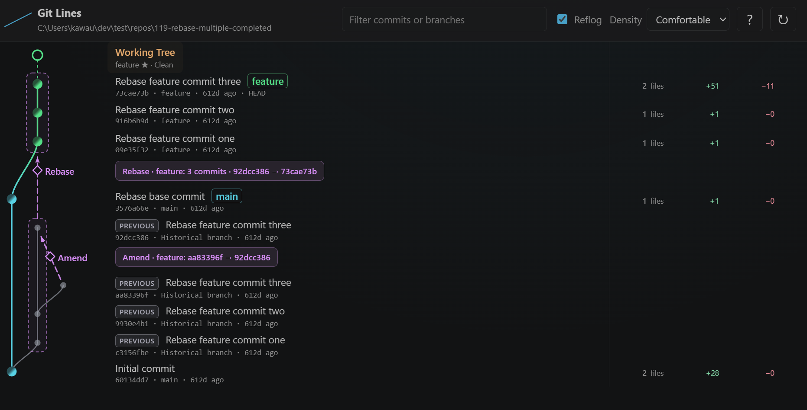
</p>

推測で履歴を補完しません。証拠が足りない操作は描かず、現在のDAGだけを残します。

## What is Git Lines?

Git Linesは、commit object の親子関係（DAG）と、いまの Working Tree を同じタイムラインに載せます。レーンは表示用の配置であり、parent edge を付け替えません。

Amend・Cherry-pick・Rebase などの操作は、reflog や commit 本文など **いま残っている Git 標準情報** で証明できるときだけ、DAG とは別層の overlay として表示します。似たメッセージや tree から source を当てません。

## Features

- ブランチの流れが崩れにくい Git graph
- Working Tree と進行中 operation の統合
- 証拠がある操作だけの Operation Overlay
- Reflog 由来の PREVIOUS / 履歴ルート
- Commit / Operation の Detail Panel
- Detached HEAD と複数 worktree の付随表示
- 読み取り専用（checkout / merge / rebase などは実行しない）

## Visual Overview

Git Lines全体の見え方です。個別のGit操作の意味は、後ろの各 accordion で説明します。

### Current DAG

現在の refs から到達できるDAGと Working Tree を表示します。

<p align="center">
  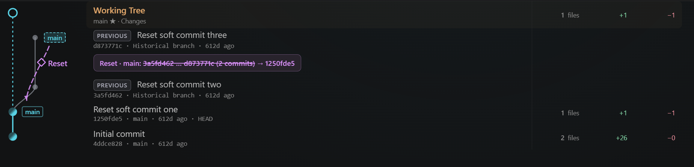
</p>

### Historical context

Reflog が有効なら、PREVIOUS、historical route、reflog-only の履歴を補助表示できます。

<p align="center">
  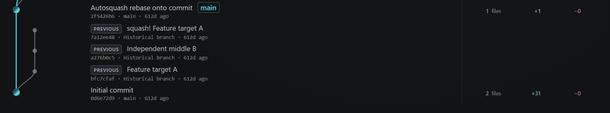
</p>

### Grouped visualization

複数の関連 commit が安全に特定できる場合、視認性のために group としてまとめることがあります。個別の semantic は各操作の accordion を見てください。

<p align="center">
  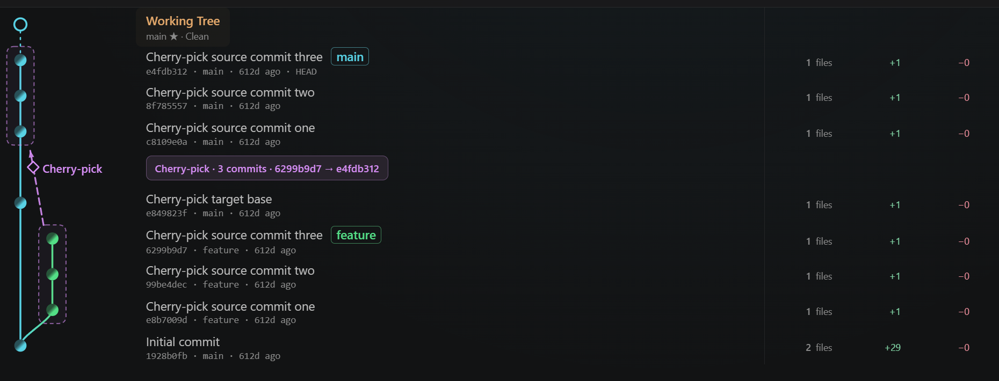
</p>

### N → 1 rewrite

複数 commit が 1 commit へ collapse したことが安全に証明できるとき、専用 overlay で示します。Interactive Squash / Fixup が代表例です。

<p align="center">
  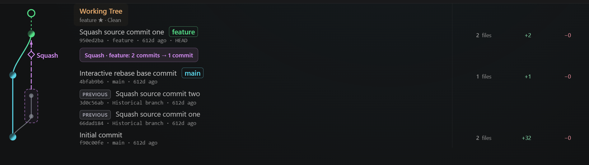
</p>

### In-progress integration

進行中の Git 操作は、独立した偽の commit ではなく Working Tree 行へ統合します。

<p align="center">
  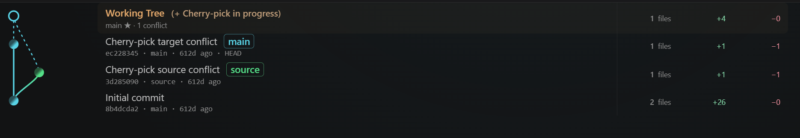
</p>

### Reflog OFF

Reflog をオフにすると overlay、PREVIOUS、reflog 依存の分類を外し、Current DAG だけへ戻します。commit message から操作を復元しません。

<p align="center">
  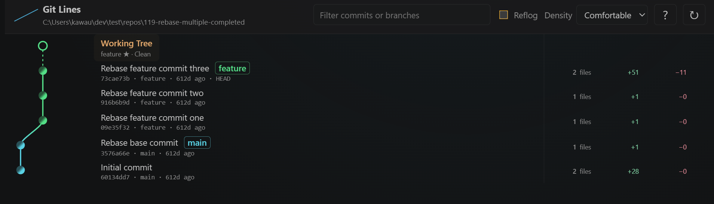
</p>

Reset / Branch move など ref の移動は、下の各操作 accordion で具体例を見られます。

## Detail Panel

グラフ上の commit と operation は、どちらも Detail で根拠まで確認できます。

<table>
  <tr>
    <td align="center" width="50%">
      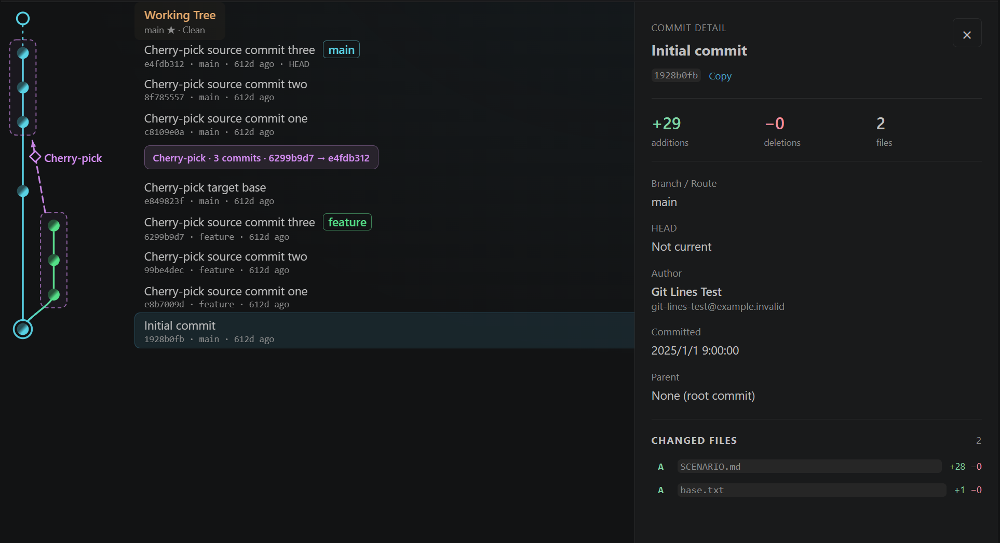<br>
      Commit
    </td>
    <td align="center" width="50%">
      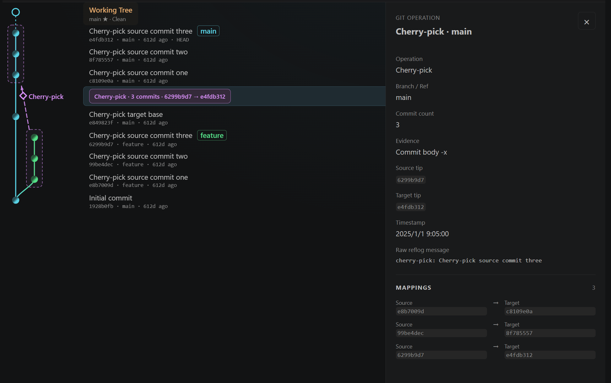<br>
      Operation
    </td>
  </tr>
</table>

Commit Detail では additions / deletions、changed files、author、parent、branch / route を見られます。

Operation Detail では操作種別と Evidence に加え、Cherry-pick なら Mappings、Rebase なら Commit order、Squash / Fixup なら Old commits / New commit / Rewrite など、その relation が実際に持っている情報だけを出します。

## Evidence-first Design

```text
Reliable evidence     → Dedicated Operation Overlay
Partial / ambiguous   → Safe fallback（generic event または Current DAG）
No reliable evidence  → Current DAG only
```

Git Lines は、commit の類似度や「こうなったはず」という推測だけでは歴史操作を描きません。証明できる範囲だけを overlay にし、それ以外はいまの DAG を優先します。

## Supported Operations

現在、実装と確認が済んでいるものだけです。

| Operation / State | Support | Visualization |
| --- | --- | --- |
| Amend | ✅ | Commit rewrite |
| Cherry-pick | ✅ | Exact relation / 連続時は visual group |
| Revert | ✅ | Cancellation relation |
| Reset | ✅ | Ref movement |
| Branch move | ✅ | Ref movement |
| Branch rename | ✅ | Rename event（位置は動かない） |
| Rebase | ✅ | Single / group rewrite |
| Interactive Squash / Fixup | ✅ | 安全な連続 N → 1 のみ |
| Detached HEAD | ✅ | 専用の HEAD 状態 |
| Multiple worktrees | ✅ | Commit 上の worktree 注釈 |
| In-progress operations | ✅ | Working Tree 行へ統合 |
| Branch delete / reflog-only | ✅ | Historical / UNREFERENCED |
| ORIG_HEAD | ✅ | 通常の commit / special ref |
| Reflog OFF | ✅ | Current DAG へ縮退 |

## Git Operations

<details>
<summary><strong>Cherry-pick</strong></summary>

source を Git 標準情報から確実に追跡できる場合だけ、source → created commit の relation を表示します。連続した Exact relation は、視認性のため visual group にまとめることがあります。

<p align="center">
  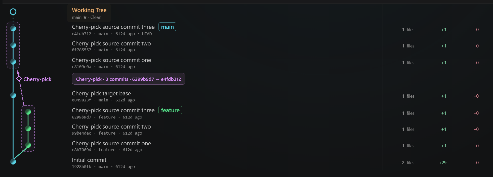
</p>

#### In progress

進行中の Cherry-pick は Working Tree 行へ統合します。

<p align="center">
  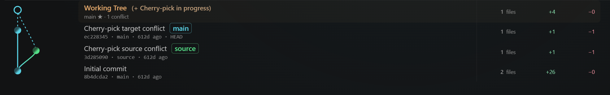
</p>

</details>

<details>
<summary><strong>Rebase</strong></summary>

完了 session と linear な old / new range を安全に復元できる場合、single または group rewrite として表示します。

#### Completed

<p align="center">
  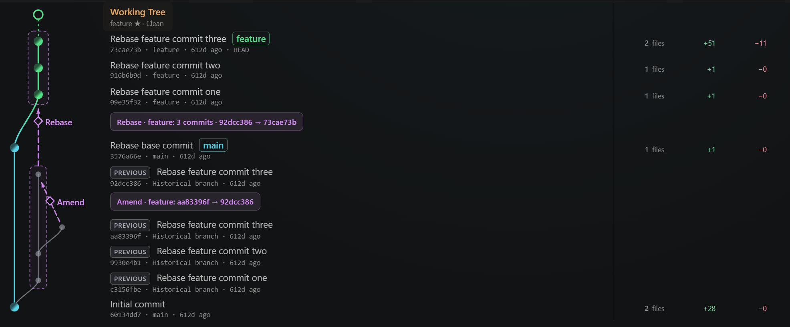
</p>

#### In progress

進行中の Rebase は Working Tree 行へ統合します。

<p align="center">
  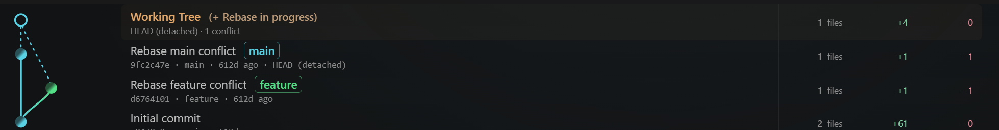
</p>

</details>

<details>
<summary><strong>Squash / Fixup</strong></summary>

Interactive Rebase で、連続した old range が 1 commit へ collapse したことと、`rebase (squash)` / `rebase (fixup)` を安全に証明できる場合だけ専用表示します。Squash の見た目は上の N → 1 rewrite と同じです。

<p align="center">
  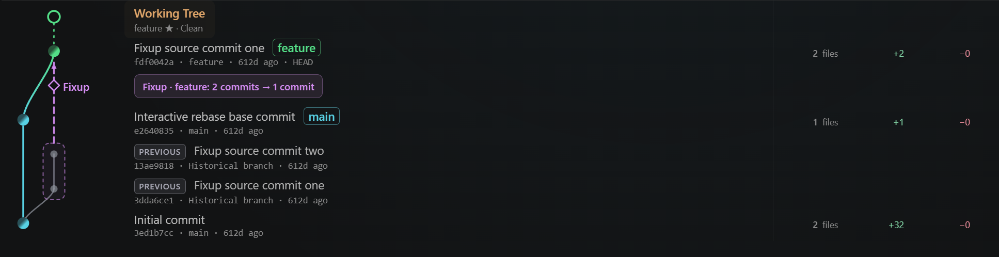
</p>

</details>

<details>
<summary><strong>Reset</strong></summary>

Reset は commit rewrite ではなく、ref の位置が動いたこととして表示します。現在の ref と、必要なら historical な ghost ref を使います。

<p align="center">
  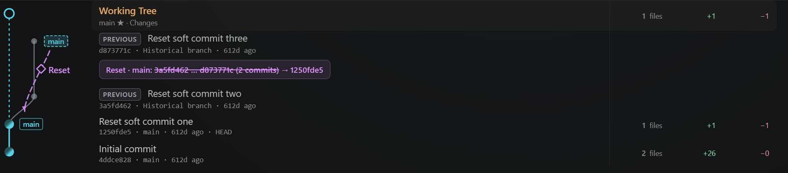
</p>

</details>

<details>
<summary><strong>Branch move</strong></summary>

branch ref の tip 移動は、Reset と同じ Ref Movement の見た目を使います。次の画像は Reset と Branch move が連続した例です。

<p align="center">
  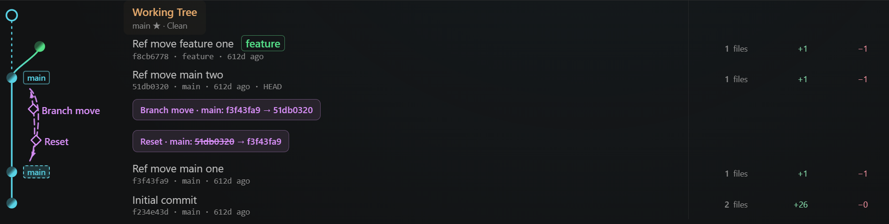
</p>

</details>

<details>
<summary><strong>Branch rename</strong></summary>

tip の位置は動かず、ref 名だけが変わった event として表示します。

<p align="center">
  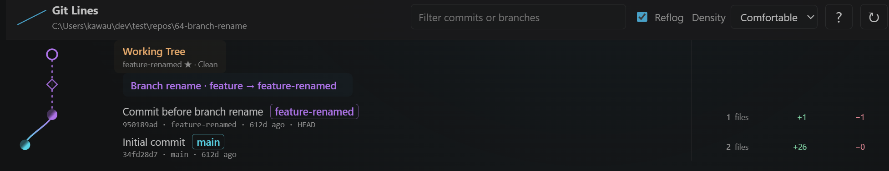
</p>

</details>

<details>
<summary><strong>Revert</strong></summary>

完了した Revert は、target の打ち消し関係として created revert commit を結ぶことがあります。target 側には専用 marker を付けます。完了専用のスクリーンショットは、現時点では README にありません。

#### In progress

進行中の Revert は Working Tree 行へ統合します。

<p align="center">
  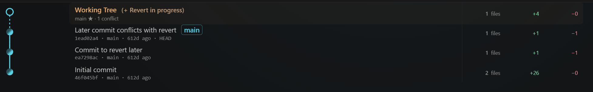
</p>

</details>

<details>
<summary><strong>Merge in progress</strong></summary>

完了した通常 Merge は Current DAG そのものなので、専用の operation overlay は出しません。進行中の Merge は Working Tree 行へ統合します。

<p align="center">
  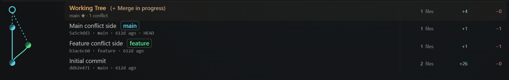
</p>

</details>

## Special Git States

<details>
<summary><strong>Detached HEAD</strong></summary>

branch ref がなくても、HEAD がいま指している commit は live な現在状態として扱います。

<p align="center">
  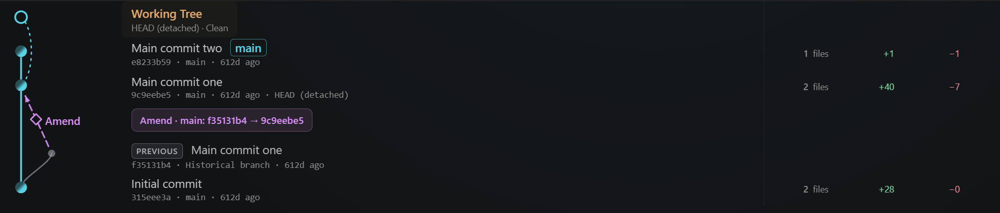
</p>

</details>

<details>
<summary><strong>Multiple Worktrees</strong></summary>

linked worktree のために新しい graph lane は作りません。対象 commit 上の注釈として表示します。

<p align="center">
  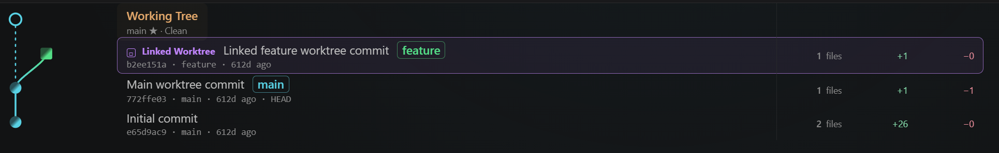
</p>

</details>

<details>
<summary><strong>Intentionally not inferred</strong></summary>

次のものは、Git 標準情報から Exact に証明できないため **未実装ではなく意図的に推測しません**。

- 完了した Squash Merge の source / range（最終 commit は通常の 1-parent に見える）
- 非連続な Interactive Squash / Fixup の member 集合
- `-x` などの確実な source が無い Cherry-pick

検出条件や研究メモは [グラフアーキテクチャ](docs/technical/graph-architecture.md) を参照してください。

</details>

## 使い方

1. Command Palette から `Git Lines: Open` を実行します。
2. ヘッダーで Reflog の表示、`Comfortable / Compact` 密度、Refresh を切り替えます。
3. commit または operation を選ぶと Detail Panel が開きます。
4. 初期表示は 30 commit です。下へスクロールすると残りが少なくなった時点で追加されます（`Load more` も利用できます）。

Marketplace 未公開です。手元では Extension Development Host で開けます。

```powershell
code --extensionDevelopmentPath="<path-to-git-lines>"
```

グラフは読み取り専用です。checkout、branch 作成、merge、rebase、push など Git を変更する操作は提供しません。

## Development

```bash
pnpm install
pnpm lint
pnpm test
pnpm build
```

一括確認は `pnpm check`（lint + test + build）です。Extension Host の bundle は `dist/extension.js`、Webview は `dist/webview` です。watch 用の `pnpm test:watch` と Webview 開発用の `pnpm dev:webview` もあります。

## Settings

| Setting | Default | 内容 |
| --- | --- | --- |
| `branchGraph.showReflog` | `true` | PREVIOUS / overlay など reflog 依存の表示 |
| `branchGraph.density` | `comfortable` | 行密度（`comfortable` / `compact`） |
| `branchGraph.initialCommitCount` | `30` | 最初に読み込む commit 数 |
| `branchGraph.loadMoreCount` | `10` | 追加読み込み件数 |
| `branchGraph.primaryBranch` | `null` | 主レーンにする branch（未指定時は自動） |

## Roadmap

今後の候補です。完了したものだけ Supported Operations へ移します。

- Interactive rebase の追加パターン（drop / reorder など）
- より複雑な merge topology
- remote / ref の境界ケース
- shallow や repository 境界

## Technical Documentation

- [グラフアーキテクチャと不変条件](docs/technical/graph-architecture.md)
